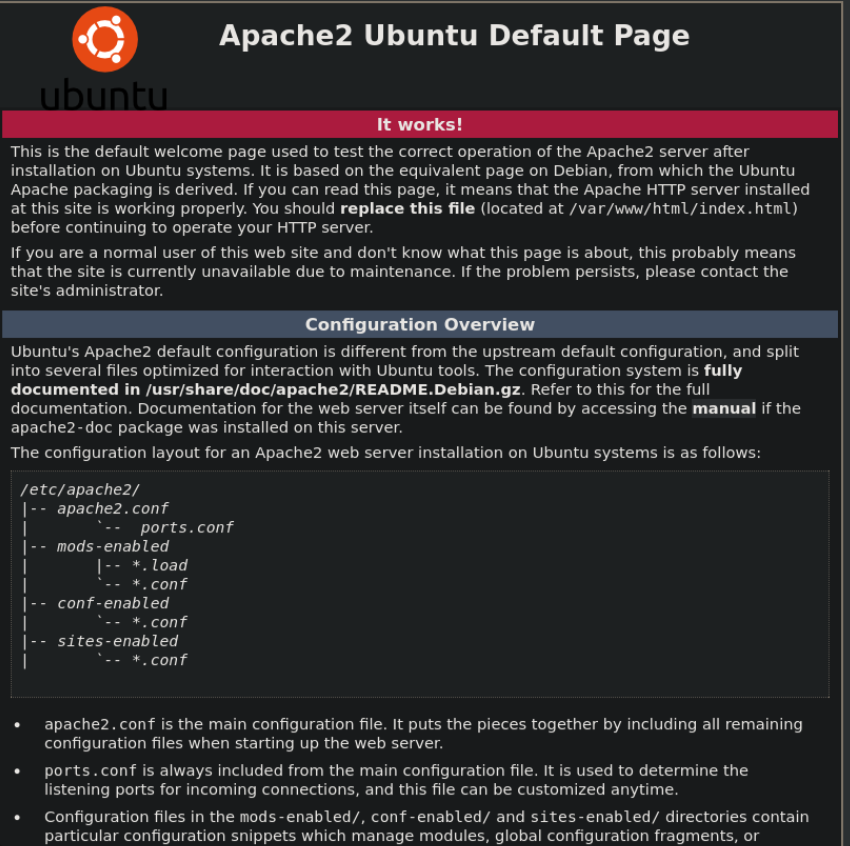
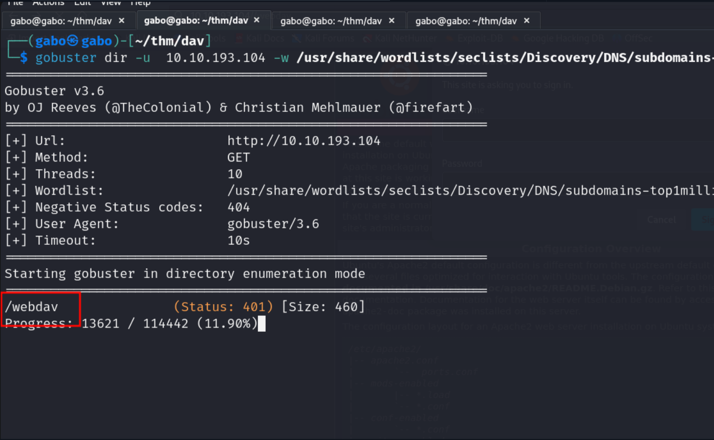
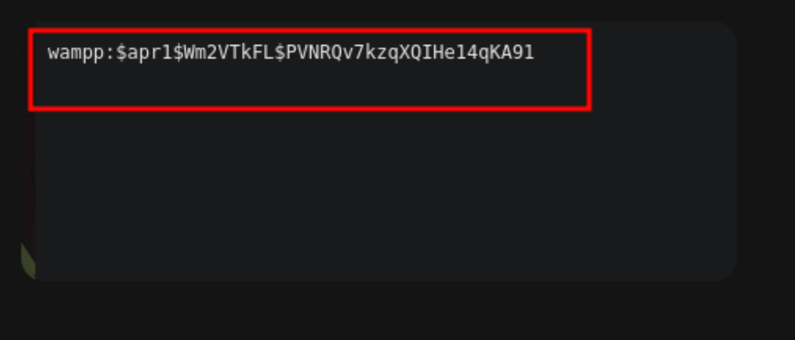

#### nmap 

En el escaneo realizado de nmap encontramos este puerto abierto 


---


Dentro del Puerto 80 encontramos este sitio Web, no encontramos nada interesante 



---


#### fuzzing

Vamos a realizar fuzzing en la web, apuntando a subdominios, ya que no encontramos nada dentro del sitio web.



---

#### subdominio

Dentro del subdominio, encontramos este panel de inicio de sesión. Busquemos en Google las credenciales predeterminadas para DAV.


---

#### credenciales

Después de investigar un poco, encontramos estas credenciales. Vamos a acceder a ellos.

Usuario : WAMPP PSWORD : Xampp


Logramos acceder, pero lo que tenemos aquí no sirve. Intentemos otro enfoque.



---


 #### uso 

Creamos una shell y en otra terminal nos colocamos en usando netcat escucha.

Donde dice "ubicación", tomaremos esa URL y la pegaremos nuevamente en el navegador. Aparecerá el panel de inicio de sesión y volveremos a usar las credenciales. Pero recuerde estar escuchando en el puerto asignado, que por ahora es 1234.

```
sudo curl --user "wamp":xamp" http://ip/webdav/ --upload-file revershell.php -v 

```


---

#### shell

conseguimos una shell 


---

conseguimos la user root 


---


#### root flag

Abusamos de los permisos SUID con

```
sudo /bin/cat /root/root.txt

``` 


---

